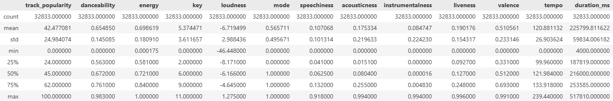
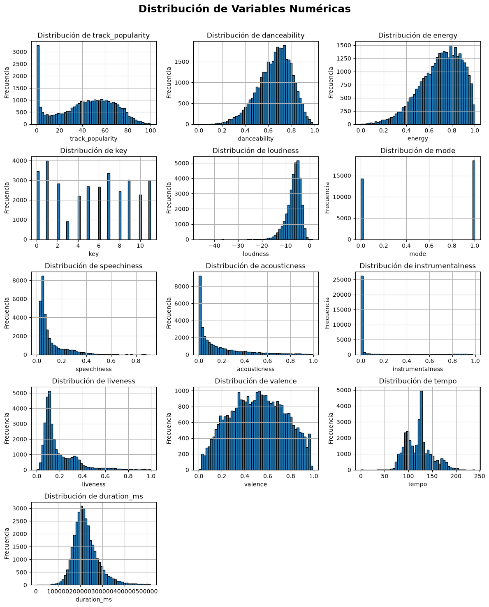
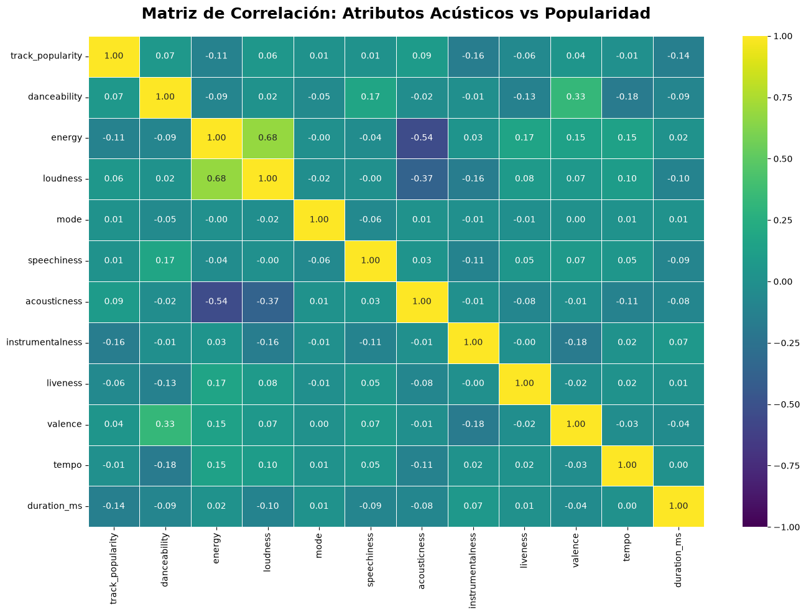
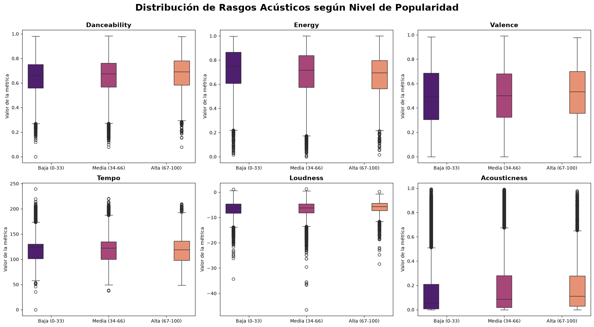

# Proyecto 1: Predicción de la Popularidad Musical en Spotify mediante Random Forest Regressor
**Integrantes: Fernando Palma e Isidora Salgado.**

## Definición del problema
El presente proyecto toma como contexto el mercado global de la música digital, un entorno sumamente competitivo donde miles de canciones compiten constantemente por captar oyentes. El problema radica en descubrir qué rasgos sonoros son los que definen un éxito comercial. Para resolverlo, se busca entrenar un algoritmo que logre proyectar la popularidad de una pista basándose estrictamente en su perfil acústico, tales como su intensidad (`energy`), índice de bailabilidad (`danceability`), positividad musical (`valence`) y su velocidad (`tempo`).

## Plan de acción
### Descripción del DataSet
Se usará el DataSet "30000 Spotify Songs". Este DataSet tiene casi 30 mil canciones de la API oficial de Spotify y cuenta con un total de 23 variables. En él, cada registro es una canción de la aplicación y tiene información como:
* track_id: id único de cada canción.
* track_name: nombre de la canción.
* track_artist: quien canta la canción.
* energy: ​La energía (de 0.0 a 1.0) indica qué tan intensa y activa se percibe una canción basándose en factores acústicos como el volumen, la velocidad y el timbre.
* danceability: ​La bailabilidad (de 0.0 a 1.0) mide qué tan buena es una canción para el baile.
* acousticness: ​La acústica (de 0.0 a 1.0) indica la probabilidad de que una canción esté hecha con instrumentos acústicos en lugar de electrónicos o sintetizados.

Además de las ya mencionadas, el conjunto de datos incluye otras variables, tales como el track-album_id, track_album_name, popularity entre otras características de audio.

### Modelo(s) seleccionado(s)
Se seleccionó un modelo de Random Forest Regressor para estimar el índice de popularidad de las pistas. Este algoritmo fue seleccionado por su capacidad de predicción de variables continuas y la captación de relaciones no lineales entre las características acústicas de las canciones. Además, permitirá identificar cuáles son los atributos sonoros específicos (como la bailabilidad o la energía) que presentan mayor influencia en el éxito de una pista.

### Estrategia de evaluación
El desempeño del algoritmo se evaluará mediante validación cruzada K-Fold con k=5. Además, la precisión de las predicciones se medirá utilizando las métricas estadísticas R², MAE y RMSE, las cuales indicarán el margen de error entre la popularidad predicha y la real.

## Justificación del modelo
La elección del predictor Random Forest se basa principalmente en su alta viabilidad para predecir en base a variables que no tienen la misma naturaleza o que son independientes entre sí, como las que tiene el dataset a trabajar.
  * Ventajas: Es altamente eficaz en datos no relacionados entre sí y no lineales, sin la necesidad de hacer transformaciones previas a los datos. Además, por cómo funciona el algoritmo, este detectará de forma automática cuáles son las variables más características del dataset para poder predecir.
  * Limitaciones: La principal desventaja es el alto costo computacional al entrenar el algoritmo con aproximadamente 30 mil datos en múltiples árboles de decisión que se generan al mismo tiempo.
  * Pertinencia: La elección de este modelo tiene toda la pertinencia, ya que para nuestro problema a resolver, el cual es tratar de predecir la popularidad de una canción, no se hace con variables lineales, sino que, esto se hace usando solo variables y características de la pista que no tienen relación directa entre ellas, escenario para el cual Random Forest es lo mejor.

## Metodología Aplicada: Análisis Exploratorio de Datos

Para realizar el análisis exploratorio, tomaremos como referencia la metodología planteada en el documento *'A Practical Guide to Introduce Exploratory Data Analysis with Python'* [1]. Tal como se ilustra el esquema a continuación, el cual dicta la estructura lógica del análisis, el proceso consistirá en obtener una visión representativa del conjunto de datos mediante un análisis descriptivo y ajustar los tipos de variables para asegurar su consistencia. Posteriormente, gestionaremos los datos faltantes y outliers para evitar sesgos y distorsiones en los resultados estadísticos. Por último, examinaremos las relaciones numéricas y gráficas entre las variables.

  

Siguiendo esta hoja de ruta visual, desarrollaremos cada una de estas etapas fundamentales:

### Análisis Descriptivo
La fase de exploración comenzó con la preparación del entorno de trabajo en Python. Para ello se incorporaron librerías como Numpy, Seaborn, Matplotlib, Pandas y Math, las cuales permiten procesar los datos y crear representaciones gráficas. Al importar la base de datos se revisaron los primeros registros para comprender la organización de la información y el formato original de las variables musicales. A continuación se presentan las primeras dos filas del conjunto de datos:

| track_id | track_name | track_artist | track_popularity | track_album_id | track_album_name | track_album_release_date | playlist_name | playlist_id | playlist_genre | key | loudness | mode | speechiness | acousticness | instrumentalness | liveness | valence | tempo | duration_ms |
| :--- | :--- | :--- | :--- | :--- | :--- | :--- | :--- | :--- | :--- | :--- | :--- | :--- | :--- | :--- | :--- | :--- | :--- | :--- | :--- |
| 6f807x0ima9a1j3VPbc7VN | I Don't Care (with Justin Bieber) Loud Luxury | Ed Sheeran | 66 | 2oCs0DGTsRO98Gh5ZSl2Cx | I Don't Care (with Justin Bieber) Loud Luxury | 2019-06-14 | Pop Remix | 37i9dQZF1DXcZDD7cfEKhW | pop | 6 | -2.634 | 1 | 0.0583 | 0.1020 | 0.00000 | 0.0653 | 0.518 | 122.036 | 194754 |
| 0r7CVbZTWZgbTCYdfa2P31 | Memories Dillon Francis Remix | Maroon 5 | 67 | 63rPSO264uRjW1X5E6cWv6 | Memories (Dillon Francis Remix) | 2019-12-13 | Pop Remix | 37i9dQZF1DXcZDD7cfEKhW | pop | 11 | -4.969 | 1 | 0.0373 | 0.0724 | 0.00421 | 0.3570 | 0.693 | 99.972 | 162600 |

Posteriormente se analizó la estructura técnica del archivo para identificar sus dimensiones exactas. Se determinó que el conjunto cuenta con 32833 filas y 23 columnas. Durante esta revisión se verificaron los formatos y los tipos de datos asignados a cada campo. Este paso es indispensable para confirmar que la base sea compatible con los métodos de análisis que se aplicarán más adelante. Los tipos de datos correspondientes a cada columna son los siguientes:

- `track_id`: str
- `track_name`: str
- `track_artist`: str
- `track_popularity`: int64
- `track_album_id`: str
- `track_album_name`: str
- `track_album_release_date`: str
- `playlist_name`: str
- `playlist_id`: str
- `playlist_genre`: str
- `playlist_subgenre`: str
- `danceability`: float64
- `energy`: float64
- `key`: int64
- `loudness`: float64
- `mode`: int64
- `speechiness`: float64
- `acousticness`: float64
- `instrumentalness`: float64
- `liveness`: float64
- `valence`: float64
- `tempo`: float64
- `duration_ms`: int64

Además, se generó un resumen estadístico de las variables numéricas, paso fundamental para identificar las medidas de tendencia central y la dispersión de la información. Así, se revela de forma cuantitativa el comportamiento de las características musicales. Los resultados obtenidos se presentan en la siguiente imagen:

  

En este caso, la popularidad de las pistas (`track_popularity`) constituye la variable objetivo del modelo predictivo y registra un promedio de 42.47 dentro de una escala de 0 a 100, con una desviación estándar cercana a los 25 puntos. Esta alta dispersión refleja un mercado musical heterogéneo donde conviven canciones sin reproducciones junto a pistas de éxito global. Por su parte, la mediana se sitúa en 45 puntos, un valor superior al promedio que confirma la presencia de un amplio segmento de canciones con un rendimiento muy bajo, las cuales terminan arrastrando la media general hacia abajo.

Respecto al perfil acústico del conjunto de datos, las estadísticas evidencian una clara inclinación hacia la música moderna y comercial, destacando canciones enérgicas con una media de 0.69 y altamente bailables al registrar una `danceability` promedio de 0.65 junto a un ritmo estandarizado cercano a los 120.8 BPM. Adicionalmente, los bajos valores en acústica (`acousticness` con 0.17) e instrumentalidad (`instrumentalness` con 0.08) indican el predominio de pistas con sonidos sintetizados y una fuerte presencia vocal, conformando una radiografía sonora que otorga el contexto numérico necesario para avanzar hacia las etapas de limpieza y modelado.

Además, para complementar estas métricas y observar la distribución real de los datos se construyó un panel de histogramas. Esta representación gráfica facilita la detección de agrupaciones y asimetrías en cada atributo acústico, tal como se expone en la siguiente imagen:

  

Al observar el gráfico de la popularidad (`track_popularity`) destaca una frecuencia de canciones con un valor de cero, sumado a una gran concentración de pistas en el sector medio que abarca entre los 40 y 60. Esto evidencia que los grandes éxitos comerciales son muy poco frecuentes dentro de este conjunto de datos.

Por otro lado, la revisión del resto de las variables confirma el estilo moderno y dinámico de la data, dado que atributos como la energía (`energy`) y la bailabilidad (`danceability`) tienden hacia los valores más altos, mientras que la acústica (`acousticness`) y la cantidad de palabras habladas (`speechiness`) se agrupan casi por completo cerca del cero. A su vez, métricas como el ritmo (`tempo`) y la positividad (`valence`) muestran una distribución mucho más equilibrada, lo cual ofrece una visión clara sobre las características y valores que el modelo de predicción deberá procesar.

### Ajuste de Tipos de Variables

Para asegurar la consistencia del conjunto de datos, se realizó un ajuste en los tipos de variables según su naturaleza. Se estandarizó la fecha de lanzamiento (`track_album_release_date`) al formato datetime, mientras que las columnas de género (p`laylist_genre`, `playlist_subgenre`) y la nota musical (`key`) se convirtieron a variables categóricas. Asimismo, se ajustó la modalidad de la pista (`mode`) a un formato booleano.

### Detección y Tratamiento de Missing Data

Tras evaluar la calidad de la información, se detectó una cantidad bastante reducida de valores nulos (equivalente al 0.0025% del total). Dado lo reducido de esta cifra, se aplicó la técnica de eliminación de filas (*row deletion*), permitiendo limpiar el conjunto de datos sin comprometer la integridad de la muestra ni la representatividad necesaria para el modelo predictivo.

### Correlación de Variables

Como paso final del análisis exploratorio, se realiza a una matriz de correlación mediante un mapa de calor para evaluar las relaciones lineales entre las variables y entender la estructura del conjunto de datos. La siguiente imagen detalla estas asociaciones:

  

Al desglosar numéricamente estas relaciones, la tabla confirma la ausencia de correlaciones lineales fuertes, ya que ningún valor supera el 0.16. Aunque se observan leves tendencias negativas en la instrumentalidad (-0.157) y la duración (-0.141), además de ligeras influencias positivas en la acústica y la bailabilidad, el impacto aislado de cada métrica sobre la popularidad resulta mínimo. Por otra parte, la matriz permite identificar dinámicas internas interesantes dentro del catálogo, como la fuerte correlación positiva entre la energía (`energy`) y el volumen (`loudness`), así como la evidente asociación negativa entre la acústica (`acousticness`) y la energía, lo cual valida el perfil sonoro moderno y producido que caracteriza a esta data.

Además, para profundizar en la relación entre los rasgos acústicos y el éxito o popularidad, se dividió la popularidad en tres niveles (baja, media y alta) y se construyeron diagramas de caja, buscando identificar si las pistas más exitosas poseen un perfil acústico diferenciado respecto a las menos escuchadas. Los resultados se exponen a continuación:

  

Para complementar la observación de los diagramas de caja, la siguiente tabla detalla las medianas obtenidas para cada atributo sonoro según el nivel de éxito comercial de las pistas. Estos indicadores permiten cuantificar la tendencia central de los datos y revisar si existen variaciones significativas entre los distintos segmentos de popularidad:

| Categoría | danceability | energy | valence | tempo | loudness | acousticness |
| :--- | :---: | :---: | :---: | :---: | :---: | :---: |
| **Baja (0-33)** | 0.661 | 0.747 | 0.493 | 123.984 | -6.251 | 0.055 |
| **Media (34-66)** | 0.675 | 0.718 | 0.502 | 121.990 | 0.088 | 0.088 |
| **Alta (67-100)** | 0.692 | 0.694 | 0.533 | 118.917 | -5.720 | 0.112 |

Con esto, tanto las gráficas como las medianas expuestas revelan una alta similitud entre las categorías, dado que las medidas centrales se superponen de forma notoria. Atributos como el ritmo (`tempo`), la energía (`energy`) y la positividad (`valence`) mantienen rangos casi idénticos independientemente del nivel de éxito de la pista. Se observa únicamente un incremento marginal en la bailabilidad (`danceability`) y el volumen (`loudness`) en las canciones más populares. Esta evidencia confirma que no existe una métrica individual que garantice el éxito, reforzando la idea de que la popularidad musical es un fenómeno complejo basado en factores que trascienden las características acústicas aisladas.

Por último y antes de pasar a los resultados, es importante comentar que el flujo de trabajo utilizó dos versiones del conjunto de datos. Mientras que en el EDA se eliminaron los registros con valores nulos para obtener métricas descriptivas exactas, para el entrenamiento del modelo  se trabajó con una muestra más amplia, conservando registros donde esos faltantes correspondían a atributos irrelevantes para la creación del predictor.

## Resultados
La idea es ver si se puede predecir la popularidad de las canciones en Spotify en base a sus características sonoras. Para eso se implementó un modelo basado en Random Forest y una validación cruzada con K-Fold de 5 particiones, con una búsqueda óptima de los mejores hiperparámetros para asegurar que el modelo fuera capaz de predecir de forma correcta datos desconocidos.

### Elección del modelo a usar
La decisión de utilizar Random Forest para predecir y no otro modelo se basa principalmente en la naturaleza de los datos del dataset. De partida se descartaron modelos como Regresión Logística o Naive Bayes, ya que estos dos son para separar categorías y en cambio, acá queremos predecir la popularidad exacta en una escala de 0 a 100. Además, las características sonoras de cada canción no funcionan en línea recta; por ejemplo, tener más volumen o más tempo no significa que la canción será más o menos popular. Para características de este tipo, los árboles de decisión son los más aptos, ya que captan estas relaciones no lineales mucho mejor que una regresión lineal sin necesidad de hacer transformaciones matemáticas previas.

### Hiperparámetros
Para llegar al modelo final se realizaron varias pruebas modificando los hiperparámetros y así poder lograr un buen equilibrio y evitar el overfitting y el underfitting. A continuación se detallan algunas pruebas que se hicieron con sus resultados:
En la primera prueba entrenamos al modelo sin restricciones, se entrenó solo utilizando 300 árboles con una profundidad de 20, sin configurar mínimo por hoja ni para partición. Dando los siguientes resultados: 

  * Resultados en conjunto de entrenamiento:
     * $R^2$ promedio: 0.84
     * MAE promedio: 7.45
     * RMSE promedio: 9.12

  * Resultados en conjunto de prueba
     * $R^2$ promedio: 0.15
     * MAE promedio: 19.50
     * RMSE promedio: 23.10

Al analizar los resultados se puede ver que el modelo se aprendió los datos de entrenamiento de memoria. El rendimiento en entrenamiento fue muy alto, llegando a un $R^2$ de 0.84 y errores muy bajos, pero al evaluar con el conjunto de validación el rendimiento bajó enormemente a un valor de 0.15 y el error se fue muy alto. Esto es claro de un modelo sobreajustado que no sirve para predecir datos nuevos.
Para tratar de amortiguar este sobreajuste se evaluó el modelo de forma contraria, evaluándolo con 1000 árboles y una profundidad de 10. Al finalizar el entreno se obtuvieron los siguientes resultados: 

  * Resultados en conjunto de entrenamiento:
     * $R^2$ promedio: 0.33
     * MAE promedio: 17.06
     * RMSE promedio: 20.52

  * Resultados en conjunto de prueba
     * $R^2$ promedio: 0.17
     * MAE promedio: 18.99
     * RMSE promedio: 22.79

Los resultados acá muestran que el modelo se asfixió y no es capaz de predecir totalmente. Aunque se volvió un poco más estable que el anterior ya que los números de entrenamiento y validación son muy parecidos, perdió la capacidad de predicción ya que tiene un valor de $R^2$ de 0.17.
Finalmente, después de iterar con distintas combinaciones se llegó a la más óptima. Esta configuración se entrenó ajustando el modelo con 300 árboles, un máximo de profundidad de cada árbol de 15 y estabilizadores de sobreajuste como un mínimo de 10 canciones para particionar una hoja del árbol y que cada hoja tenga 5 canciones como mínimo. Estos hiperparámetros permitieron los siguientes resultados: 

  * Resultados en conjunto de entrenamiento:
     * $R^2$ promedio: 0.58
     * MAE promedio: 13.24
     * RMSE promedio: 16.15

  * Resultados en conjunto de prueba
     * $R^2$ promedio: 0.24
     * MAE promedio: 18.01
     * RMSE promedio: 21.82

Decidimos dejar esta configuración porque así le damos al modelo el suficiente espacio y profundidad para que pueda predecir de forma correcta, pero con las restricciones necesarias para bajar el sobreajuste en los datos, cayendo así de un 0.84 a un 0.58. Conseguimos de esta forma la mejor predicción de datos desconocidos para el modelo, logrando el $R^2$ más alto posible en el conjunto de prueba, $R^2$=0.24, y reduciendo el error MAE a su punto más bajo de tan solo 18.01.

### Análisis final
Luego de entrenar el modelo con la configuración más efectiva, se logró controlar el sobreajuste para que el predictor no memorice los datos del conjunto de entrenamiento, obteniendo así un $R^2$ de 0.58 en los datos de entrenamiento y un $R^2$ de 0.24 en el conjunto de validación. La razón de que el $R^2$ en el conjunto de validación sea de solo un 24% indica que si bien el modelo es capaz de predecir la popularidad de una canción en base a sus atributos, no se puede predecir con total certeza solo fijándose en esos datos, ya que el éxito está basado casi en su totalidad en agentes externos como el marketing, la fama del artista o si se hace viral en alguna red social. En cuanto a su estabilidad, las métricas arrojaron un margen de error MAE de 18.01 y un RMSE de 21.82 puntos, lo que confirma que el modelo no comete grandes fallos con frecuencia.
Finalmente, al analizar el gráfico de importancia de características, se puede ver que el modelo al predecir se basa principalmente en sus 3 variables más importantes, que son la duración de la canción, qué tan instrumental es y el volumen de la misma, indicando que la estructura básica y qué tan fuerte suena son la clave para la popularidad de una canción. Luego, atributos como el ritmo o la energía sí aportan a la predicción, pero no son tan importantes como las 3 anteriores. Por último, características como la nota principal o la escala casi no le importan al modelo al momento de predecir, lo que confirma que a la gente no le importa en qué nota esté compuesta la canción al momento de hacerse popular.

## Referencias

`[1]` Ministerio de Asuntos Económicos y Transformación Digital, Guía práctica para realizar un Análisis Exploratorio de Datos con Python, Gobierno de España, 2021. https://datos.gob.es/sites/default/files/documentacion/files/guide_eda_python.pdf.
